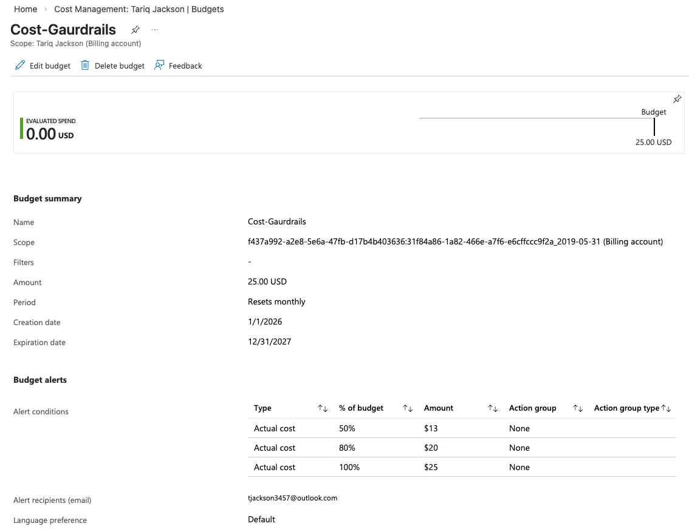
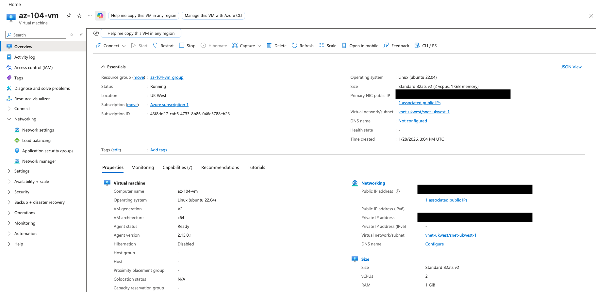
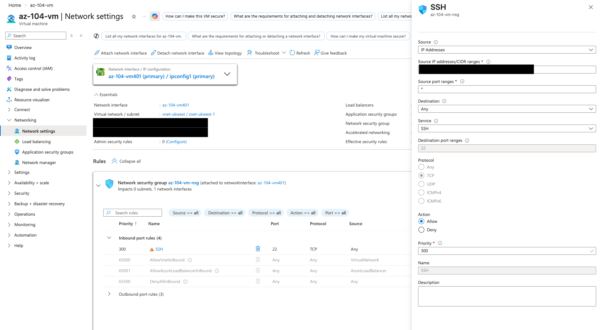
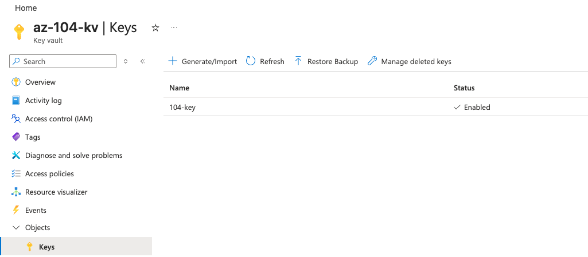
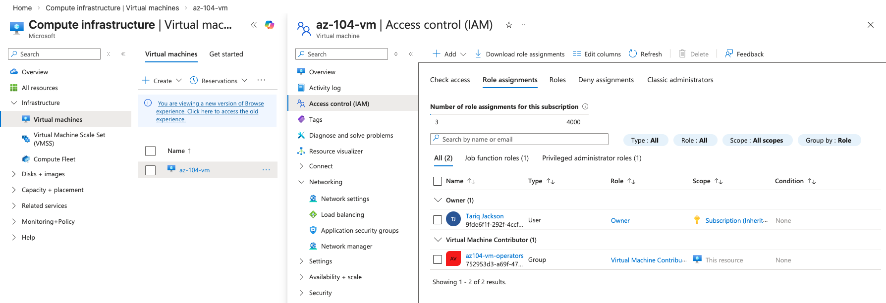
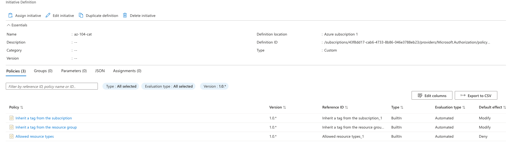
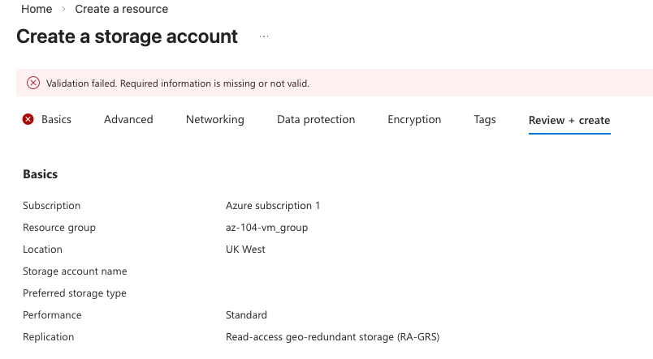
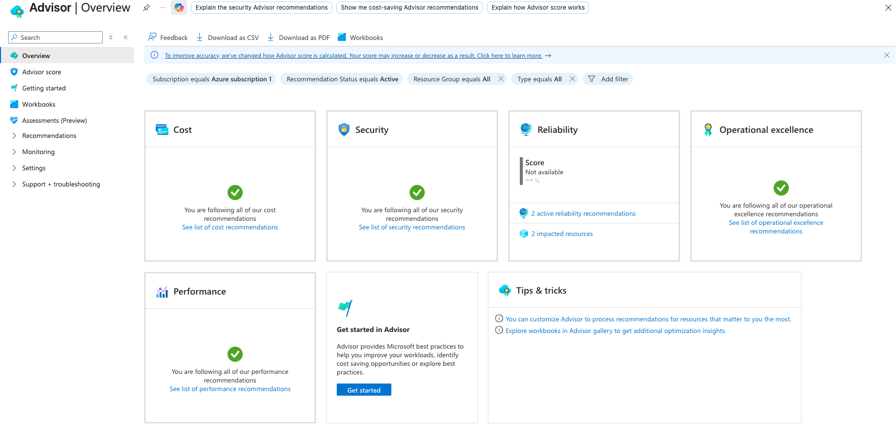
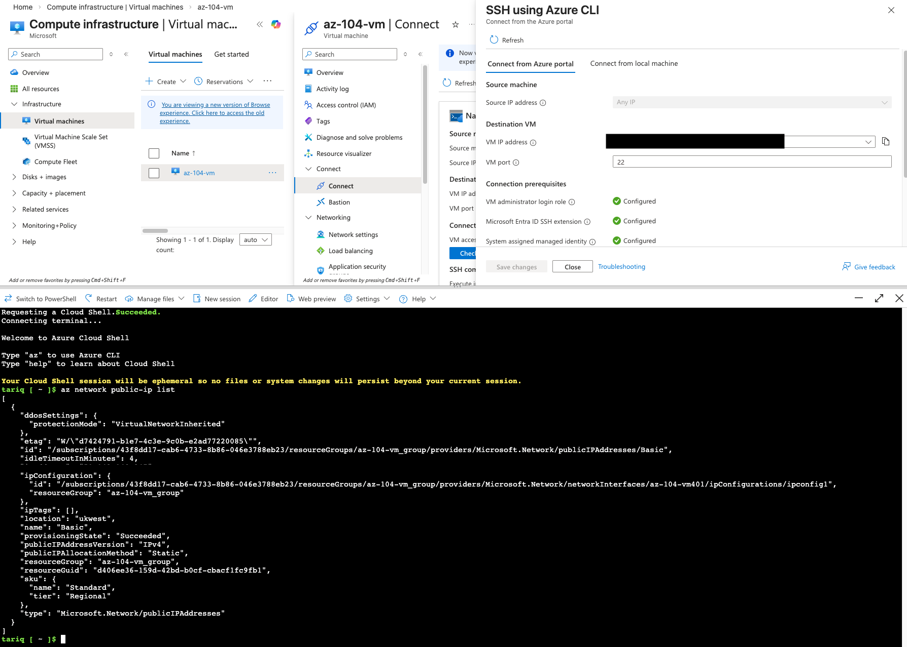

# Azure Compute & Governance Lab (AZ-104)

## Overview
This project demonstrates how to deploy and govern Azure compute resources using enterprise-grade practices. It focuses on secure VM deployment, identity and access management, governance with Azure Policy, network hardening, and cost control.

The lab aligns with AZ-104 objectives for:

- Virtual Machines  
- Identity & Access Management (RBAC, Entra ID)  
- Governance & Compliance (Azure Policy)  
- Networking (NSGs)  
- Cost Management  

## Architecture

- 1× Ubuntu VM  
- Virtual Network + Subnet  
- Network Security Group with IP-restricted SSH  
- Azure Key Vault  
- Entra ID Group for RBAC  
- Azure Policy Initiative  
- Subscription Budget & Alerts  

## Implementation

### 1. Cost Guardrails

A subscription budget was created to prevent unexpected spend.

- Monthly budget: **$25**
- Alerts at 50%, 80%, and 100%

### 2. Virtual Machine Deployment

An Ubuntu VM was deployed using cost-efficient and secure defaults.

### 3. Network Security

The Network Security Group allows SSH (port 22) **only from my public IP**.

Attempting to access the VM via a browser fails, proving that HTTP/HTTPS is blocked and
only SSH is permitted.

### 4. Secure Access with Key Vault

Secrets such as the SSH key were stored securely in Azure Key Vault.

### 5. Role-Based Access Control (RBAC)

An Entra ID group was granted `Virtual Machine Contributor` at VM scope.

### 6. Governance with Azure Policy

A custom initiative enforces:

- Required `owner` tag  
- Inherited tags  
- Allowed resource types  
- Allowed locations  

Non-compliant resources are blocked.

### 7. Cost Monitoring

Cost trends and spend were reviewed using Cost Analysis and Azure Advisor.

### 8. VM Access via Azure CLI

The VM was accessed securely using Azure Cloud Shell.

## Lessons Learned

- How RBAC controls operational access  
- How Azure Policy prevents misconfiguration  
- How NSGs enforce zero-trust access  
- How budgets protect against runaway spend  
- How Cost Analysis and Advisor support optimisation  

This project demonstrates:

**Deploy → Secure → Govern → Monitor → Optimise**

It reflects real Azure operations at a junior cloud engineer level.
